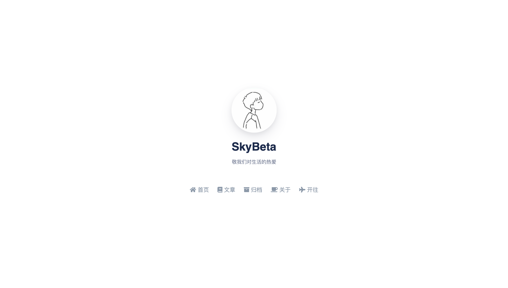

# Sky

> 敬我们对生活的热爱。

Sky 是一个简洁的单栏响应式 Typecho 主题。

Demo：[skywt.cn](https://skywt.cn/)

## 使用 / Usage

前往 Releases 下载源代码压缩包，解压后将文件夹重命名为 sky 并移动到 Typecho 主题目录，在 Typecho 后台启用主题。
在主题设置中进行一些设置之后才可以较为完善地使用。

建议在「Typecho 后台设置 - 阅读 - 站点首页」中选择「直接调用 homepage.php 模板文件」，体验一个简洁的全屏首页。

### 关于字段（themeFields）

- 文章头图地址：填入一个图片 URL 地址, 就可以让文章加上头图。
- 页面 icon：为页面填入一个 fontawesome icon 代码，在菜单栏链接前会显示 icon。对文章无效。Fontawesome 是 5.15 版本，参见：[Fontawesome Icons](https://fontawesome.com/v5.15/icons)。举例：填入 `fa fa-coffee` 则会显示咖啡杯图标。
- 重定向至：输入一个 URL，打开页面时会自动重定向到这个 URL，用于定制菜单栏。对文章无效。

## 说明 / Instructions

### 引用的库和资源

集成了 highlight.js，不建议使用其他代码高亮的插件。
集成了 darkreader.js，不建议使用其他启用 Darkmode 的插件。

- [Argon Design System](https://demos.creative-tim.com/argon-design-system/index.html)
  - jQuery (via jsDelivr)
  - Bootstrap 4 (via jsDelivr)
  - Popper.js
- Fontawesome (via Staticfile)
- highlight.js (via jsDelivr)
- darkreader.js (vis jsDelivr)
- [lately.js](https://github.com/Tokinx/lately)

### 关于浏览器支持

不支持 IE 等上古浏览器。
由于使用了 `sticky-top` 等较为先进的特性，可能也不能很好地支持部分国产魔改内核浏览器（如某度浏览器）或者主流浏览器的落后版本。请尽量使用较新的主流浏览器访问以获得最佳体验。

## 许可 / License

GNU GENERAL PUBLIC LICENSE

## 更新记录 / Changelog

### 1.0

- 第一个能用的正式版本！

### 1.2

这是第一个自认为比较完善的版本，虽然功能有所不足，不过整体体验还算可以。

- 增加了友情链接页面
- 用 Darkreader.js 实现 Darkmode
- 增加网站管理工具栏，登录后可见
- 使用 CDN（jsDelivr）调取一些资源，提高访问速度
- 优化部分样式，修复一些 bug
